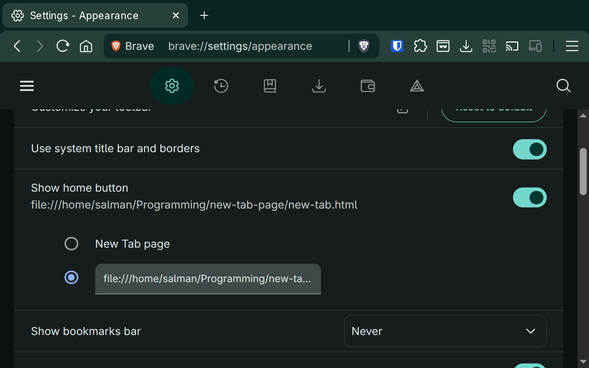

# Instructions:

Save `new-tab.html` somewhere locally on your computer and edit it as needed. Then configure your browser to open it on new tabs like so:

```
file:///home/salman/Programming/new-tab-page/new-tab.html
```

On Chrome it can be done at `chrome://settings/appearance`:


Tip: Use `Control`+`=` and `Control`+`-` shortcuts in the browser to quickly change zoom levels instead of changing all the size values in code.
